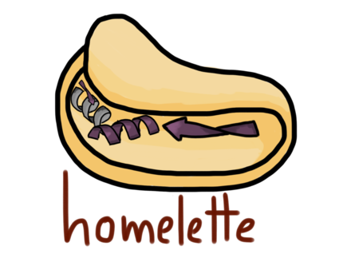

# homelette

A Python package offering a unified interface to different software for generating and evaluating homology models. This enables users to easily assemble custom homology modelling pipelines. `homelette` is extensively documented, lightweight and easily extendable.

For more information, please check out our [online documentation](https://homelette.readthedocs.io/).



## Installation

The simplest way to use homelette is to access it through our prepared docker container. For more information, please check `homelette/docker` or the [documentation](https://homelette.readthedocs.io/).

homelette can also be installed from PIP.

```bash
python3 -m pip install homelette
```

Instructions on how to install homology modelling and evaluation dependencies can be found in our [documentation](https://homelette.readthedocs.io/).

## Examples

There is a series of eight tutorials available demonstrating the use and extension of our homology modelling interface. Tutorials are available on our [documentation webpage](https://homelette.readthedocs.io/) or as interactive Jupyter Notebooks in our Docker image or in `homelette/examples`.

## License

homelette is freely available under the [MIT](https://choosealicense.com/licenses/mit/) license.
